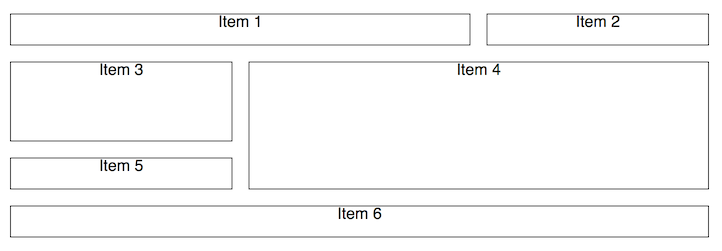
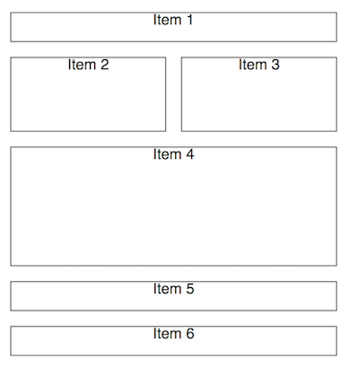
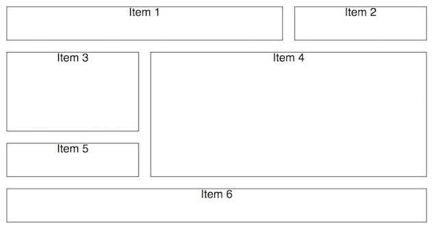
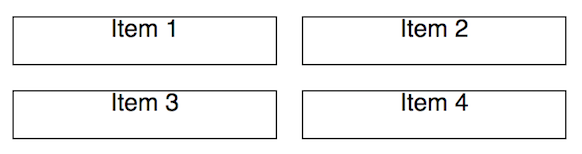
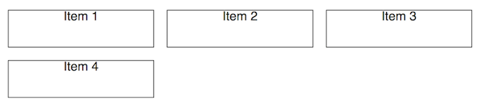

# regridder

Simple React js responsive grid layout system.

## Contents

- [Overview](#overview)
- [Installation](#installation)
- [API Reference](#api-reference)
- [Examples](#examples)
- [Further Notes](#further-notes)

## Overview

Regridder allows developers to easily (and [simply](https://www.infoq.com/presentations/Simple-Made-Easy)) create flexible and responsive grid layouts within their React js applications. Regridder makes use of the excellent [CSS Grid Layout](https://developer.mozilla.org/en-US/docs/Web/CSS/CSS_Grid_Layout) feature, and uses the same syntaxes for prop values. Regridder also uses [styled-components](https://github.com/styled-components/styled-components) to apply media queries for responsiveness.

## Installation

`npm i regridder`

or

`yarn add regridder`

Refer to the docs for your version of npm or yarn if you encounter issues installing this package.

## API Reference

Be sure to check out the [CSS Grid Layout Documentation](https://developer.mozilla.org/en-US/docs/Web/CSS/CSS_Grid_Layout) for various prop syntaxes – in general, camelCased component props should map to a dash-cased css property within that documentation (though not all component props have a css property equivalent).

### `Grid` props

Note that all `Grid` props are optional.

`breakpoints`

- Array of strings
- Defines responsive breakpoint width values
- E.g. `['500px', '700px']`
- Default value: `['40em', '52em', '64em']`

`alignItems`

- String
- Defines the vertical alignment of items in the grid
- E.g. `'end'`

`justifyItems`

- String
- Defines the horizontal alignment of items in the grid
- E.g. `'center'`

`gridGap`

- String
- Defines the amount of space between grid items (vertically and horizontally)
- E.g. `'1em'`

`numRows`

- Integer
- Defines the number of rows the grid should have (rows are usually added automatically)
- E.g. `4`

`rowHeight`

- String
- Defines the height of the rows
- E.g. `'2em'`

`fixedRows`

- String
- Defines the number of rows, as well as their heights
- E.g. `'2em 1em'` or `'repeat(4, 1em)'`
- Note that you may prefer to use fractional heights, using the `fr` unit (instead of `em` in the above examples)

`numColumns`

- Integer
- Defines the number of columns the grid should have
- E.g. `2`

`columnWidth`

- String
- Defines the width of the columns
- E.g. `'2em'`

`fixedColumns`

- String
- Defines the number of columns, as well as their widths
- E.g. `'2em 1em'` or `'repeat(4, 1em)'`
- Note that you may prefer to use fractional widths, using the `fr` unit (instead of `em` in the above examples)

### `GridItem` props

Note that all `GridItem` props are optional.

`rowStart`

- Integer
- Defines the row that the item should start at (inclusive)
- E.g. `2`
- Note that row counting starts at `1`

`rowEnd`

- Integer
- Defines the row that the item should end at (exclusive)
- E.g. `4`

`rowSpan`

- Integer
- Defines how many rows the item should cover
- E.g. `2`

`columnStart`

- Integer
- Defines the column that the item should start at (inclusive)
- E.g. `2`
- Note that column counting starts at `1`

`columnEnd`

- Integer
- Defines the column that the item should end at (exclusive)
- E.g. `4`

`columnSpan`

- Integer
- Defines how many columns the item should cover
- E.g. `2`

`gridArea`

- String
- Defines precisely where the item should be placed in the grid
- E.g. `'1 / 1 / 2 / 3'` – this translates to: `rowStart: 1`, `columnStart: 1`, `rowEnd: 2`, `columnEnd: 3`

### Responsiveness

For all `Grid` and `GridItem` props, you may provide a single value (as documented above), or an array of values – if you provide an array of values, each value will be used at appropriate responsive breakpoints. For example, if you provide `[1, 2, 3]` as the value for a prop, `1` will be used below the smallest breakpoint, `2` will be used from the next breakpoint and up, `3` will be used from the next breakpoint and up etc. Also note that if you provide a single value for a prop, that value will be used at all breakpoints.

## Examples

### SimpleLayout

Starting off fairly simple, we'll define a grid with 3 columns and add 6 items to the grid, specifying how many rows and columns some of the items should span, while keeping defaults for others. Note that by default, a grid item will span one column and one row.



```js
import React from "react";
import { Grid, GridItem as BaseGridItem } from "regridder";

// This is just to add a border for better visibility of grid items
const GridItem = props => (
  <BaseGridItem style={{ border: "1px solid black" }} {...props} />
);

const SimpleLayout = () => (
  <Grid
    numColumns={3}
    rowHeight="2em"
    gridGap="1em"
    style={{ textAlign: "center" }} // this is just for nicer viewing of text
  >
    <GridItem columnSpan={2}>Item 1</GridItem>
    <GridItem>Item 2</GridItem>
    <GridItem rowSpan={2}>Item 3</GridItem>
    <GridItem rowSpan={3} columnSpan={2}>
      Item 4
    </GridItem>
    <GridItem>Item 5</GridItem>
    <GridItem columnSpan={3}>Item 6</GridItem>
  </Grid>
);

export default SimpleLayout;
```

Creating a layout that is responsive to the screen width of a user's device can be achieved by simply providing arrays of values for relevant props in the Grid and/or GridItem components. In the following example, we specify that the number of columns, the row height and the width/height of various grid items should vary respective to the default breakpoints (`['40em', '52em', '64em']`). Note that you can also provide your own breakpoints to the `Grid` component, and you can use whichever unit of measurement you'd prefer.

Mobile View:



Desktop View:



```js
import React from "react";
import { Grid, GridItem as BaseGridItem } from "regridder";

// This is just to add a border for better visibility of grid items
const GridItem = props => (
  <BaseGridItem style={{ border: "1px solid black" }} {...props} />
);

const ResponsiveLayout = () => (
  <Grid
    numColumns={[2, 3]}
    rowHeight={["2em", "3em"]}
    gridGap="1em"
    style={{ textAlign: "center" }} // this is just for nicer viewing of text
  >
    <GridItem columnSpan={2}>Item 1</GridItem>
    <GridItem rowSpan={[2, 1]}>Item 2</GridItem>
    <GridItem rowSpan={2}>Item 3</GridItem>
    <GridItem rowSpan={3} columnSpan={2}>
      Item 4
    </GridItem>
    <GridItem columnSpan={[2, 1]}>Item 5</GridItem>
    <GridItem columnSpan={[2, 3]}>Item 6</GridItem>
  </Grid>
);

export default ResponsiveLayout;
```

## Further Notes

If you're only interested in defining a simple, uniform layout and don't need to position and manipulate individual items within your grid, then you don't need to use the `GridItem` component at all, and can pass your own custom components as children to the `Grid`. For example:

Mobile View:



Desktop View:



```js
import React from "react";
import { Grid } from "regridder";

// This is just to add a border for better visibility of grid items
const itemStyle = { border: "1px solid black" };

const SuperSimpleLayout = () => (
  <Grid
    numColumns={[2, 3]}
    rowHeight={["2em", "3em"]}
    gridGap="1em"
    style={{ textAlign: "center" }} // this is just for nicer viewing of text
  >
    <div style={itemStyle}>Item 1</div>
    <span style={itemStyle}>Item 2</span>
    <div style={itemStyle}>Item 3</div>
    <span style={itemStyle}>Item 4</span>
  </Grid>
);

export default SuperSimpleLayout;
```
